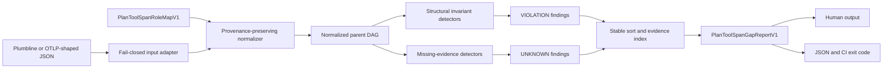

# Plan and tool span gap finder

`plumbline span-gaps` converts incomplete or malformed trace structure into a deterministic,
evidence-indexed `PlanToolSpanGapReportV1`. It accepts Plumbline traces and JSON in either a compact
`{"spans": [...]}` shape or OTLP's nested `resourceSpans[].scopeSpans[].spans[]` shape. It never calls a
model, collector, provider, or network service.

## Contract boundary

The analyzer separates three things that are easy to blur:

| Layer | Source | What P07 does |
|---|---|---|
| Standard requirement | OpenTelemetry tracing API and semantic conventions | Validates OTel trace/span IDs, parent references, trace membership, and time ordering. Treats the trace as a parent/child DAG. |
| Development convention | OTel GenAI agent conventions | Provides default mappings for `create_agent`, `invoke_agent`, `invoke_workflow`, `plan`, and `execute_tool`. These conventions are **Development**, not stable. Provider-specific conventions may use a different documented span name. |
| Plumbline design inference | P07 | Defines lifecycle, plan-evidence, outcome-connectivity, workflow-membership, and missing-capture rules. These are local, versioned detector semantics; they are not claimed as universal OTel requirements. |
| Fixture behavior | `tests/fixtures/span-gaps/` | Supplies small synthetic detector inputs only. These are not replay fixtures, interoperability proof, or evidence of vendor adoption. |

Standards snapshot: **2026-08-11**. The GenAI documentation was read at official commit
[`8d3e4a0f3c34a46f6edb9c71e8666e02e6bf3958`](https://github.com/open-telemetry/semantic-conventions-genai/commit/8d3e4a0f3c34a46f6edb9c71e8666e02e6bf3958),
where agent and framework spans are `Development` and reference core semantic conventions v1.44.0.
The OTel tracing API defines traces as parent/child DAGs and valid `SpanContext` identifiers, but it
does not require every agent framework to emit every lifecycle operation. In particular, `create_agent`
is usually applicable to remote agent services, while `invoke_agent` also has an internal in-process
form. Therefore a missing create/invoke counterpart is `UNKNOWN` unless `agent_lifecycle` capture is
explicitly declared `complete`.

## Architecture



Every normalized node retains its raw source path, raw name, source format, trace ID, matched mapping
IDs, timestamps, attributes, and declared parents. Reports expose bounded, scrubbed provenance through
`evidence_index`; they do not echo arbitrary payloads or tool arguments.

## Invariants and gaps

| Code | Invariant | Classification rule |
|---|---|---|
| `ORPHAN_TOOL_EXECUTION` | An `execute_tool` node has an agent or workflow ancestor. | `VIOLATION` only when span capture is complete; otherwise `UNKNOWN`. |
| `MISSING_PARENT` | A semantic child such as a tool execution or result carries a parent reference. | Completeness-sensitive. |
| `MULTIPLE_PARENTS` | A span has at most one semantic parent. OTel links are not treated as parents. | Deterministic violation. |
| `CREATE_WITHOUT_INVOKE` | A created agent has a later invocation with the same configured agent ID. | Lifecycle-completeness-sensitive. |
| `INVOKE_WITHOUT_CREATED_AGENT` | An invoked agent has an earlier creation with the same configured agent ID. | Lifecycle-completeness-sensitive; default is `UNKNOWN` because in-process agents need not emit create spans. |
| `PLAN_STEP_WITHOUT_EXECUTION` | A plan node has execution descendants or an explicit plan-step reference. | Plan-completeness-sensitive. |
| `TOOL_RESULT_WITHOUT_INVOCATION` | A tool result's call ID joins to a prior execute-tool node. | Event-completeness-sensitive. |
| `WORKFLOW_SUBTREE_ESCAPE` | A node carrying a workflow ID descends from the matching workflow node. | Deterministic violation when both nodes are present. |
| `CYCLE` | Parent edges form a DAG. | Deterministic violation. |
| `DUPLICATE_ID` | Node IDs are unique in the supplied document. | Deterministic violation. |
| `BROKEN_SPAN_REFERENCE` | Every declared parent resolves. | Deterministic violation. |
| `BROKEN_TRACE_REFERENCE` | Parent and child belong to the same trace. | Deterministic violation. |
| `INVALID_TRACE_ID` / `INVALID_SPAN_ID` | OTLP IDs are non-zero lowercase hex of the OTel-defined width. | Deterministic violation; not applied to Plumbline step IDs. |
| `IMPOSSIBLE_ORDERING` | End is not before start; children do not start before their parent; lifecycle/result joins are chronological. OTel permits an ended span to remain a parent, so a later child start is not rejected. | Deterministic violation. |
| `DISCONNECTED_OUTCOME` | An outcome is bound to execution ancestry (or a Plumbline run with observed execution). | Outcome-completeness-sensitive. |
| `AMBIGUOUS_MAPPING` | A raw node maps to only one semantic role. | Deterministic warning and failing violation because the semantic interpretation is not unique. |

`severity` describes impact. `confidence` describes evidence certainty. `classification=VIOLATION` means
the supplied structure deterministically breaks an invariant. `classification=UNKNOWN` means required
absence evidence is not admissible because capture completeness is partial or unknown. Missing proof is
never rendered green.

## Input and mappings

Compact OTel-shaped input can add a completeness declaration:

```json
{
  "capture_scope": {
    "spans": "complete",
    "events": "partial",
    "agent_lifecycle": "unknown",
    "plans": "complete",
    "outcomes": "complete"
  },
  "spans": []
}
```

Each value is `complete`, `partial`, or `unknown`; omitted fields fail closed to `unknown`.

Vendor or harness aliases are configured rather than baked into the detector:

```json
{
  "schema_version": "PlanToolSpanRoleMapV1",
  "mode": "extend",
  "mappings": [
    {
      "id": "vendor.run_tool",
      "role": "execute_tool",
      "match": {
        "span_name_prefixes": ["vendor.tool.run"],
        "attributes": {"vendor.operation": ["run_tool"]}
      }
    }
  ]
}
```

Matchers are ORed within a rule. `mode=extend` preserves the default OTel and Plumbline mappings;
`mode=replace` makes the supplied map authoritative. Supported roles are `create_agent`, `invoke_agent`,
`plan`, `invoke_workflow`, `execute_tool`, `tool_result`, `outcome`, and `compaction`. Custom maps do
not rewrite raw names, standard join-key attributes, or provenance. Vendor traces should retain
canonical join keys such as `gen_ai.agent.id`, `gen_ai.tool.call.id`, and `gen_ai.workflow.id` when
available. If two rules assign different roles, the report emits
`AMBIGUOUS_MAPPING` instead of guessing.

## Five-minute demo

From the repository root:

```sh
uv run plumbline span-gaps tests/fixtures/span-gaps/healthy-single.json
uv run plumbline span-gaps tests/fixtures/span-gaps/malformed-graph.json --format json
uv run plumbline span-gaps tests/fixtures/span-gaps/vendor-aliases.json \
  --mapping tests/fixtures/span-gaps/vendor-alias-map.json --gate
```

The first command prints `PASS`. The second prints precise finding and evidence IDs. The third proves
that a vendor alias map can normalize a healthy trace without modifying the raw fixture.

### CLI and exit codes

```text
plumbline span-gaps TRACE [--mapping MAP] [--format human|json] [-o OUTPUT] [--gate]
```

Without `--gate`, a valid analysis exits `0` regardless of disposition. With `--gate`:

| Exit | Meaning |
|---:|---|
| `0` | `PASS`: no detected violation or missing-data gap. |
| `1` | `FAIL`: at least one deterministic `VIOLATION`. |
| `2` | Invalid input or mapping; no report is emitted. |
| `3` | `UNKNOWN`: no violation, but at least one completeness-sensitive gap remains unresolved. |

JSON output validates against
[`schema/plan-tool-span-gap-report.schema.json`](schema/plan-tool-span-gap-report.schema.json).
The new command and report are additive: existing Plumbline trace, outcome, WorkGraph, scorer, and CLI
contracts are unchanged.

## Extension checklist

1. Prefer an official `gen_ai.operation.name` mapping when one exists; add provider aliases only when
   the provider documents a different name.
2. Give each mapping a stable, namespaced ID and keep raw names available as evidence.
3. Do not infer completeness from the absence of telemetry. Set `capture_scope` from producer knowledge.
4. Add one small positive and one malformed detector input. Do not generate replay fixtures here; that
   belongs to P10.
5. Preserve deterministic sorting, scrubbed evidence, no network/model calls, and report-schema validity.
6. Version a breaking report change; do not silently change `PlanToolSpanGapReportV1`.

## Claim ceiling

A green report proves only that the supplied, mapped capture has no detected gap under these local
invariants. It does not prove complete telemetry, vendor interoperability, agent correctness, ecosystem
adoption, live runtime uptake, production safety, or outcome truth.
